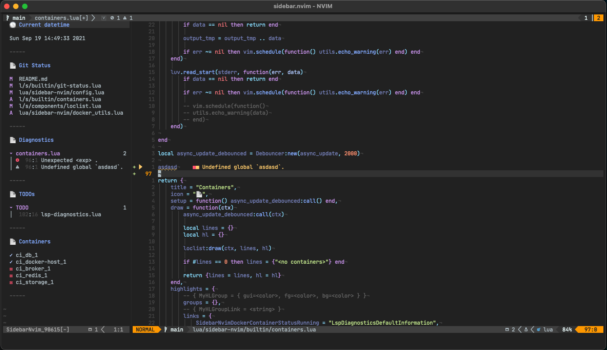

# sidebar.nvim

A generic and modular lua sidebar inspired by [lualine](https://github.com/hoob3rt/lualine.nvim)

Development status: Alpha - bugs are expected



## Quick start

```lua
ocal sidebar = require("sidebar-nvim")
local opts = {open = true}
sidebar.setup(opts)
```

See [options](#options) for a full list of setup options

## TODOs (Need help)

- [ ] Better section icons
- [ ] Improve docs + write vim help files
- [ ] See repo issues, any contribution is really appreciated

## Options

Sidebar setup options.

Minimal configuration

```lua
require("sidebar-nvim").setup()
```

Defaults:

```lua
require("sidebar-nvim").setup({
    disable_default_keybindings = 0,
    bindings = nil,
    open = false,
    side = "left",
    initial_width = 35,
    update_interval = 1000,
    sections = { "datetime", "git-status", "lsp-diagnostics" },
    section_separator = "-----",
    docker = {
        attach_shell = "/bin/sh", show_all = true, interval = 5000,
    },
    datetime = { format = "%a %b %d, %H:%M", clocks = { { name = "local" } } },
    todos = { ignored_paths = { "~" } }
})
```

#### `disable_default_keybindings`

Default: 0

Enable/disable the default keybindings

#### `bindings` {#bindings}

Default: nil

Attach custom bindings to the sidebar buffer.

Example:

```lua
require("sidebar-nvim").setup({
    bindings = { ["q"] = function() require("sidebar-nvim").close() end }
})
```

Note sections can override these bindings, please see [Section Bindings](#bindings-1)

#### `side`

Default: `left`

#### `initial_width`

Default: 50

#### `update_interval`

Default: 1000

Update frequency in milliseconds

#### `sections`

Default: `{ "datetime", "git-status", "lsp-diagnostics" }`

Which sections should the sidebar render

See [Bultin Sections](##builtin-sections) and [Custom Sections](##custom-sections)

#### `section_separator`

Default: `-----`

Can be a string or a function with like the following:

```lua
function section_separator(section)
    return "-----"
end
```

`section` is the section definition. See [Custom Sections](##custom-sections) for more info

## Builtin Sections

#### datetime

Prints the current date and time using. You can define multiple clocks with different timezones or offsets.

NOTE: In order to use timezones you need to install `luatz` from luarocks, like the following if using `packer`:
```lua
use {
    "GustavoKatel/sidebar.nvim",
    rocks = {'luatz'}
}
```

This dependency is optional, you can use the `offset` parameter to change the clock, which does not require extra dependencies.

##### config {#datetime-config}

Example configuration:

```lua
require("sidebar-nvim").setup({
    ...
    datetime = {
        format = "%a %b %d, %H:%M",
        clocks = {
            { name = "local" }
        }
    }
    ...
})
```

Clock options:
```lua
{
    name = "clock name", -- defaults to `tz`
    tz = "America/Los_Angeles", -- only works if using `luatz`, defaults to current timezone
    offset = -8, -- this is ignored if tz is present, defaults to 0
}
```

You can see a list of all [available timezones here](https://en.wikipedia.org/wiki/List_of_tz_database_time_zones)

#### git-status

Prints the status of the repo as returned by `git status --porcelain`

##### keybindings {#git-status-keybindings}

| key | when | action |
|-----|------|--------|
| `e` | hovering filename | open file in the previous window

#### lsp-diagnostics

Prints the current status of the builtin lsp grouper by file. It shows only loaded buffers

##### keybindings {#lsp-diagnostics-keybindings}

| key | when | action |
|-----|------|--------|
| `e` | hovering diagnostic message | open file in the previous window at the diagnostic position
| `t` | hovering filename | toggle collapse on the group

#### todos

Shows the TODOs in source. Provided by [todo-comments](https://github.com/folke/todo-comments.nvim)

There are some small issues using this section see https://github.com/folke/todo-comments.nvim/pull/63
So you might want to consider using my fork instead https://github.com/GustavoKatel/todo-comments.nvim

##### config {#todos-config}

```lua
require("sidebar-nvim").setup({
    ...
    todos = {
        ignored_paths = {'~'}, -- ignore certain paths, this will prevent huge folders like $HOME to hog Neovim with TODO searching
    }
    ...
})
```

##### keybindings {#todos-keybindings}

| key | when | action |
|-----|------|--------|
| `e` | hovering todo location | open file in the previous window at the todo position
| `t` | hovering the group | toggle collapse on the group

#### containers

Shows the system docker containers. Collected from `docker ps -a '--format=\'{"Names": {{json .Names}}, "State": {{json .State}}, "ID": {{json .ID}} }\''`

NOTE: in some environments this can be a very intensive command to run. You may see increased cpu usage when this section is enabled.

##### config {#containers-config}

```lua
require("sidebar-nvim").setup({
    ...
    docker = {
        use_podman = false,
        attach_shell = "/bin/sh",
        show_all = true, -- whether to run `docker ps` or `docker ps -a`
        interval = 5000, -- container update interval. The fetch command will run every 5s
    }
    ...
})
```

##### keybindings {#containers-keybindings}

| key | when | action |
|-----|------|--------|
| `e` | hovering a container location | open a new terminal and attach to the container with `docker exec -it <container id> ${config.docker.attach_shell}`

## Api

Public api is available as:

`require("sidebar-nvim").<function>`

| Function | Vim command | Description |
|----------|-------------|-------------|
| toggle() | `SidebarNvimToggle` | Open/close the view |
| close() | `SidebarNvimClose` | Close if open, otherwise no-op |
| open() | `SidebarNvimOpen` | Open if closed, otherwise no-op |
| update() | `SidebarNvimUpdate` | Immediately update the view and the sections |
| resize(size) | `SidebarNvimResize <size>` | Resize the view width to `size`. `size` is a number. 
| focus() | `SidebarNvimFocus` | Move the cursor to the sidebar window |
| get_width(tabpage) | - | Get the current width of the view from the current `tabpage`. `tabpage` is the tab page number, if null it will return the width in the current tab page |
| reset_highlight | - | Use in case of errors. Clear the current highlighting so it can be re-rendered |

## Custom Sections

sidebar.nvim accepts user defined sections. The minimal section definition is a table with a `draw` function that returns the string ready to render in the sidebar and a title. See below the list of available properties

```lua

local section = {
    title = "Section Title",
    icon = "->",
    setup = function(ctx)
        -- called only once and if the section is being used
    end,
    update = function(ctx)
        -- hook callback, called when an update was requested by either the user of external events (using autocommands)
    end,
    draw = function(ctx)
        return "> string here\n> multiline"
    end,
    highlights = {
        groups = { MyHighlightGroup = { gui="#C792EA", fg="#ff0000", bg="#00ff00" } },
        links = { MyHighlightGroupLink = "Keyword" }
    }
}

```

#### `setup` {#sidebar.setup()}

This function is called only once *and* only if the section is being used
You can use this function to create timers, background jobs etc

#### `update`

This plugin can request the section to update its internal state by calling this function. You may use this to avoid calling expensive functions during draw.

NOTE: This does not have any debouncing and it may be called multiples times, you may want to use a [debouncer](#debouncer)

Events that trigger section updates:

- `BufWritePost *`
- `VimResume *`
- `FocusGained *`

#### `draw`

The function accepts a single parameter `ctx` containing the current width of the sidebar:

```lua
{ width = 90 }
```

The draw function may appear in three forms:

- Returning a string
- Returning a table of strings
- Returning a table like `{ lines = "", hl = {} }`

The later is used to specify the highlight groups related to the lines returned

Example:

```lua

local section = {
    title = "test",
    draw = function()
        return {
            lines = {"> item1", "> item2"},
            hl = {
                -- { <group name>, <line index relative to the returned lines>, <column start>, <column end, -1 means end of the line> }
                { "SectionMarker", 0, 0, 1 },
            }
        }
    end
}

```

#### `highlights`

Specify the highlight groups associated with this section. This table contains two properties: `groups` and `links`

- `groups` define new highlight groups
- `links` link highlight groups to another

Example:

```lua
local section = {
    title = "Custom Section",
    icon = "->",
    draw = function()
        return {
            lines = {"hello world"},
            hl = {
                -- more info see `:h nvim_buf_add_highlight()`
                { "CustomHighlightGroupHello", 0, 0, 5 }, -- adds `CustomHighlightGroupHello` to the word "hello"
                { "CustomHighlightGroupWorld", 0, 6, -1 }, -- adds `CustomHighlightGroupWorld` to the word "world"
            },
        }
    end,
    highlights = {
        groups = { CustomHighlightGroupHello = { gui="#ff0000", fg="#00ff00", bg="#0000ff" } },
        links = { CustomHighlightGroupWorld = "Keyword" }
    }
}
```

more info see: [:h nvim_buf_add_highlight](https://neovim.io/doc/user/api.html#nvim_buf_add_highlight())

#### `bindings` {#custom-bindings}

Custom sections can define custom bindings. Bindings are dispatched to the section that the cursor is currently over.

This means that multiple sections can define the same bindings and SidebarNvim will dispatch to the correct section depending on the cursor position.

Example:

```lua
local lines = {"hello", "world"}
local section = {
    title = "Custom Section",
    icon = "->",
    draw = function()
        return lines
    end,
    bindings = {
        ["e"] = function(line, col)
            print("current word: "..lines[line])
        end,
    },
}
```

## Builtin components

Builtin components abstract ui elements that can be reused within sections.

### Loclist

Create a location list with collapsable groups.

Sections using it: [git-status](#git-status), [lsp-diagnostics](#lsp-diagnostics) and [todos](#todos)

Example:
```lua
local Loclist = require("sidebar-nvim.components.loclist")
local loclist = Loclist:new()
loclist:add_item({ group = "my_group", lnum = 1, col = 2, text = "my cool location", icon = { text = "#", hl = "MyCustomHighlightGroup" } })

-- inside the section draw function
local lines, hl = {}, {}

table.insert(lines, "Here's the location list you asked:")

loclist:draw(ctx, lines, hl)

return { lines = lines, hl = hl }

```

## Utils

### Debouncer

This can be used to avoid multiple calls within a certain time frame. It's useful if you want to avoid multiple expensive computations in sequence.

Example:

```lua
local Debouncer = require("sidebar-nvim.debouncer")

local function expensive_computation(n)
    print(n + 1)
end

local expensive_computation_debounced = Debouncer:new(expensive_computation, 1000)

expensive_computation_debounced:call(42) -- print(43)
expensive_computation_debounced:call(42) -- does nothing

vim.defer_fn(function()
    expensive_computation_debounced:call(43) -- print(44)
    expensive_computation_debounced:call(43) -- does nothing
end, 1500)
```

## Third party sections

- [dap-sidebar.nvim](https://github.com/GustavoKatel/dap-sidebar.nvim) - Show Dap breakpoints in the sidebar

## Colors

| Highlight Group | Defaults To |
| --------------- | ----------- |
| *SidebarNvimSectionTitle* | Directory |
| *SidebarNvimSectionSeparator* | Comment |
| *SidebarNvimGitStatusState* | Keyword |
| *SidebarNvimGitStatusFileName* | Normal |
| *SidebarNvimLspDiagnosticsError* | LspDiagnosticsDefaultError |
| *SidebarNvimLspDiagnosticsWarn* | LspDiagnosticsDefaultWarning |
| *SidebarNvimLspDiagnosticsInfo* | LspDiagnosticsDefaultInformation |
| *SidebarNvimLspDiagnosticsHint* | LspDiagnosticsDefaultHint |
| *SidebarNvimLspDiagnosticsLineNumber* | LineNr |
| *SidebarNvimLspDiagnosticsColNumber* | LineNr |
| *SidebarNvimLspDiagnosticsFilename* | Label |
| *SidebarNvimLspDiagnosticsTotalNumber* | LspTroubleCount |
| *SidebarNvimLspDiagnosticsMessage* | Normal |
| *SidebarNvimTodoTag* | Label |
| *SidebarNvimTodoTotalNumber* | Normal |
| *SidebarNvimTodoFilename* | Normal |
| *SidebarNvimTodoLineNumber* | LineNr |
| *SidebarNvimTodoColNumber* | LineNr |
| *SidebarNvimDockerContainerStatusRunning* | LspDiagnosticsDefaultInformation |
| *SidebarNvimDockerContainerStatusExited* | LspDiagnosticsDefaultError |
| *SidebarNvimDockerContainerName* | Normal |
| *SidebarNvimDatetimeClockName* | Comment |
| *SidebarNvimDatetimeClockValue* | Normal |

## References

We based most of the code from the awesome work of @kyazdani42 in [nvim-tree](https://github.com/kyazdani42/nvim-tree.lua)

## Contributors

[@GustavoKatel](https://github.com/GustavoKatel/)
[@davysson](https://github.com/davysson/)
