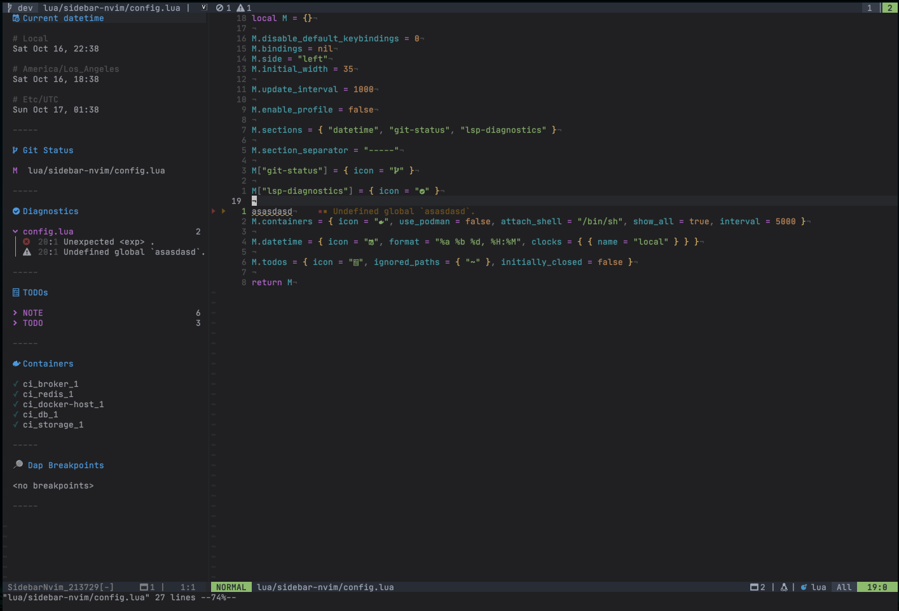

# sidebar.nvim

A generic and modular lua sidebar inspired by [lualine](https://github.com/hoob3rt/lualine.nvim)

Development status: Alpha - bugs are expected



## Quick start

```lua
local sidebar = require("sidebar-nvim")
local opts = {open = true}
sidebar.setup(opts)
```

See [options](./doc/general.md#options) for a full list of setup options

## Requirements

- Neovim 0.6
- Nerdfonts (requirement by the default icons, you can change the icons to remove this requirement)

## Quick links

- [Options, commands, api and colors](./doc/general.md)
- [Builtin sections](./doc/builtin-sections.md)
- [Custom sections](./doc/custom-sections.md)


## TODOs (Need help)

- [x] Better section icons - users can define custom icons see [Options](./doc/general.md#options)
- [ ] Allow sections to define custom hl groups for icons
- [ ] Improve docs + write vim help files
- [ ] See repo issues, any contribution is really appreciated


## Third party sections

- [dap-sidebar.nvim](https://github.com/GustavoKatel/dap-sidebar.nvim) - Show Dap breakpoints in the sidebar

## Development

We are trying to limit the frequency of merges to the default branch, therefore less noise during plugin update and possible less bugs.

If you don't mind frequent updates and/or want to test new features, you might want to check the `dev` branch.

Before reporting a bug, please check if the bug still exists in the `dev` branch.

## References

We based most of the code from the awesome work of @kyazdani42 in [nvim-tree](https://github.com/kyazdani42/nvim-tree.lua)

## Contributors

[@GustavoKatel](https://github.com/GustavoKatel/)
[@davysson](https://github.com/davysson/)
